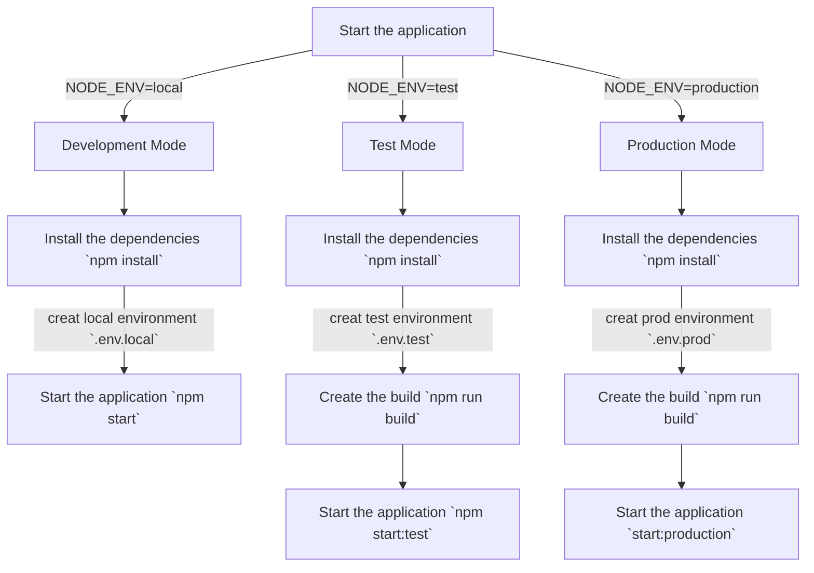

# [monotest-api]()

MonoTest API(Node.js application written in TypeScript)

## Core NPM Module

- [x] `express`, `@types/express`
- [x] `@types/node`
- [x] `typescript`
- [x] `dotenv`
- [x] `cors`
- [x] `helmet`
- [x] `http-status-codes`
- [x] `winston`, `@types/winston`

# Start the application

## Start The application in Development Mode

- Clone the Application `git clone https://github.com/Olusoladeboy/mono-test-api.git`
- Install the dependencies `npm install`
- Start the application `npm start`

## Start The application in Production Mode

- Install the dependencies `npm install`
- Create the build `npm run build`
- Start the application `npm run start:production`
- Before starting make sure to creat prod environment `.env.prod` file

## Project Structure

| Name                              | Description |
| --------------------------------- | ----------- |
| **wiki/**                         | You can add project documentation and insructions file here |
| **src/**                          | Source files |
| **src/abstractions**              | Abstarct classes and Interfaces  |
| **src/components**                | REST API Components & Controllers  |
| **src/environments**              | Application Environments Handling utility  |
| **src/lib**                       | Reusable utilises and library source code like a logger|
| **src/middleware/**               | Express Middlewares like error handler feature |
| **build/**                        | Compiled source files will be placed here |
| **tests/**                        | Test cases will be placed here |
| **tests/helpers/**                | Helpers for test cases will be placed here  |
| **tests/unit-tests/**             | Unit Test cases will be placed here  |
| **tests/integration-tests/**      | API routes (Integration) Test cases will be placed here|

## Encryption

Set the `APPLY_ENCRYPTION` environment variable to `true` to enable encryption.

## Default System Health Status API

- `${host}/api/user/register` - Register A New User [POST]
- `${host}/api/user/link-account` - Link Account to Mono [PUT]
- `${host}/api/user/unlink-account` - unlink account [PUT]
- `${host}/api/user` -  Return User details [GET]
- `${host}/api/user/` - Delete Account [DELETE]
